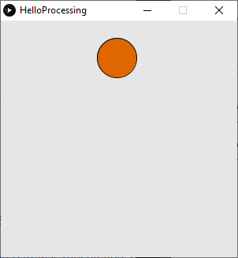
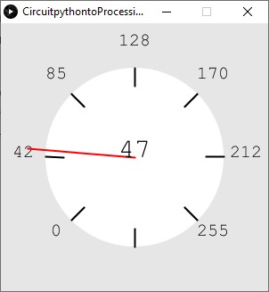
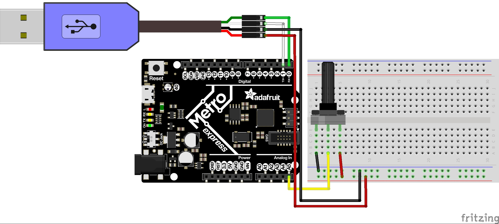
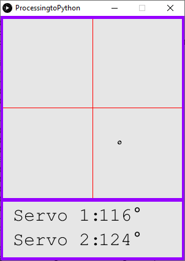
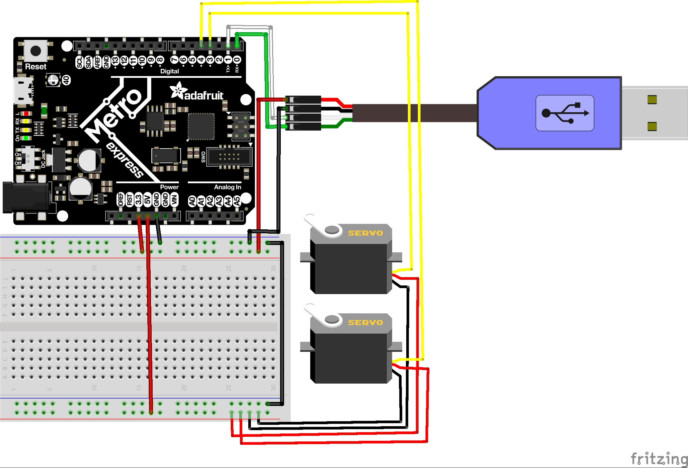

# Expert CircuitPython
For all my Processing-related projects.
## [Hello Processing](/HelloProcessing/HelloProcessing.pde)
This one was pretty straight forward. I had no problems, and just learned some basic Processing functions. I did learn that I can have my if statements in one line, if the code inside it is only one line. It looks very clean.
 
## [CircuitPython to Processing](/CircuitpythontoProcessing_py/CircuitpythontoProcessing_py.pde)
This one was tricky. The [Circuit Python part](/CircuitpythontoProcessing.py) was mostly fine, but I made a mistake where I forgot the square brackets in the bytes function. With Processing I had a big problem with a simple solution. The data I was receiving made no sense. Serial.list() was displaying three ports, but I never changed what I copied from the project page. In the Serial initialization at the top I needed to switch it from port 1 to port 2, which I thought I had already tried. I also had a small problem where I had my transmitting and receiving wires switched. To make the dial display, I mostly just messed around with pi values until it was in the right spot.
 
## [Processing to CircuitPython](/ProcessingtoPython/ProcessingtoPython.pde)
This one was also tricky. Making the GUI was straight forward enough, if not time-consuming. I then used the mouseMoved function to only send data when the mouse position was moved. Then I limited it to only sending it once every tenth of a second. I had a lot of problems with [the CircuitPython part](/ProcessingReceiver.py). My first problem came when I tried to decode the incoming bytes. I knew I was receiving the right numbers because when I printed the byte itself, it displayed it as a byte literal, which looks like a string with a "b" in front of it. The problem that, since I was using mouseMoved, I was sending "None" to the uart whenever the mouse wasn't moving. The decode function doesn't take Nonetype objects and spits out and error. The solution was just to test if it was None before decoding. So now I was receiving the right numbers and symbols, but I had a new problem. I would sometimes receive duplicate numbers or symbols, which would mess up the code I was trying to write. This had to do with how Processing would have to send up to eight bytes (six for the numbers, two for the delimiters) every tenth of a second and CircuitPython was trying to read only one byte in that time. The backlog was somehow messing this up and the solution was to make CircuitPython run ten times faster. This fixed my problem instantly.
 
